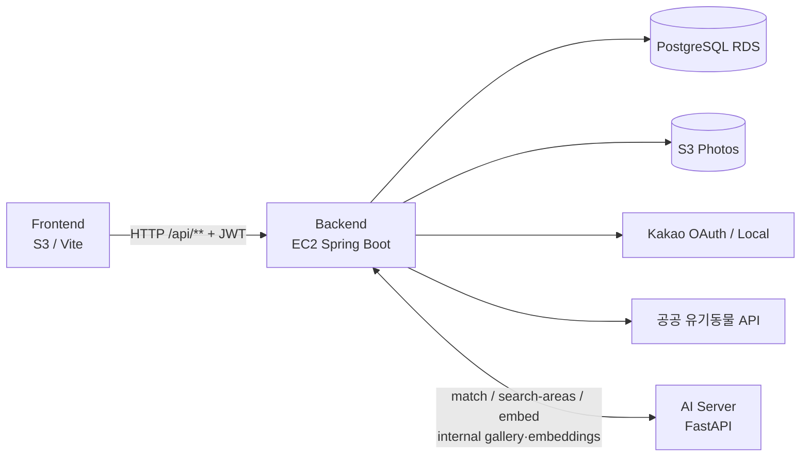
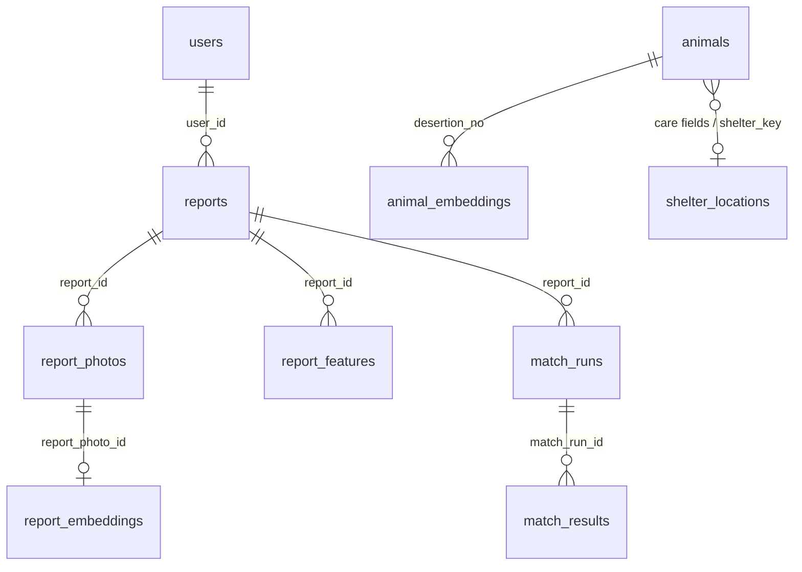

# PawPawFind Backend

이 저장소(PawPawFind-Backend)의 README입니다.  
현재 구현된 코드(`backend/`)를 기준으로 작성했습니다. 기준 브랜치: `develop`.

관련 기획 스냅샷: [docs/backend-기능명세서.md](./docs/backend-기능명세서.md)

### 상세 API 보조 문서

| 문서 | 담당 | 내용 |
|------|------|------|
| [docs/auth-api.md](./docs/auth-api.md) | 강유진 | 카카오 로그인 |
| [docs/reports-api.md](./docs/reports-api.md) | 강유진 | 제보 · 사진 · 특징 |
| [docs/uploads-presign-api.md](./docs/uploads-presign-api.md) | 강유진 | S3 Presign |
| [docs/animals-api.md](./docs/animals-api.md) | 강유진 | 보호소 공고 · `/abandoned` |
| [docs/match-api.md](./docs/match-api.md) | 강유진 | 유사 동물 매칭 |
| [docs/embedding-internal-api.md](./docs/embedding-internal-api.md) | 강유진 | 임베딩 · 갤러리 internal |
| [docs/health-api.md](./docs/health-api.md) | 강유진 | Health |
| [docs/nearby-reports-api.md](./docs/nearby-reports-api.md) | 김가윤 | 주변 제보 |
| [docs/search-area-api.md](./docs/search-area-api.md) | 김가윤 | 추천 수색 영역 |

---

## 기여자

| 역할 | 담당자 | 주요 담당 범위 |
|------|--------|----------------|
| Backend · Infrastructure | 강유진 | Spring Boot REST API · JWT 인증 · DB 설계 · AWS 인프라 구축 · CI/CD 자동화 · 서버 배포 |
| Location-based Features (AI + BE) | 김가윤 | 추천 수색 영역 알고리즘 · 주변 제보 검색 · 보호소 지오코딩 · 프로젝트 초기 설정 |
| AI Matching Model | 주가빈 | YOLO 객체 검출 · DINOv2 임베딩 · 이미지 유사도 검색 · 재정렬(Reranking) |
| Frontend | 신주현 | React 화면 전반 구현 · 디자인 시스템 · UI/UX · API 연동 · 사용자 인터랙션 |
| Map Feature | 박소민 | Kakao Maps API 연동 · 지도 기반 기능 구현 |

프로젝트는 세 개의 저장소로 나뉘어 있다.

| 저장소 | 내용 |
|--------|------|
| PawPawFind-Backend (현재 저장소) | Spring Boot API 서버 |
| PawPawFind-AI | FastAPI 기반 매칭 · 수색 영역 추천 서버 |
| PawPawFind-Frontend | React 웹 클라이언트 |

---

## 1. 프로젝트 개요

### 백엔드의 역할

Spring Boot 애플리케이션이 다음을 담당한다.

- 실종(`LOST`) / 목격(`FOUND`) 제보 CRUD (사진 URL, 특징 태그 포함)
- 카카오 OAuth 로그인 후 JWT 발급
- 공공 유기동물(보호소 공고) 수집·저장·조회
- 보호소 주소 지오코딩(카카오 Local, 설정으로 on/off)
- S3 사진 업로드용 Presigned URL 발급
- AI 서버와 매칭·임베딩·추천 수색 영역 연동
- AI가 사용하는 internal API (갤러리·임베딩 batch·매칭 결과 저장)

### 시스템 구조



### 다른 구성요소와의 관계

| 구성요소 | 관계 |
|----------|------|
| Frontend | CORS로 허용된 오리진에서 `/api/**` 호출. 로그인 시 `Authorization: Bearer <JWT>` |
| AWS EC2 | Backend JAR를 systemd(`pawpawfind-backend`)로 실행 |
| AWS RDS | 운영 DB (PostgreSQL). 로컬은 H2 in-memory |
| AWS S3 | 제보 사진 Presigned PUT + public `photoUrl` |
| AI 서버 | `ai.service.url` 기준. BE→AI: `/match`, `/search-areas`, `/embed/*`. AI→BE: `/api/internal/**` |
| Kakao | REST API 키로 토큰 교환·사용자 조회, (옵션) Local 주소 검색 |

---

## 2. 기술 스택

출처: `backend/build.gradle`, `gradle/wrapper/gradle-wrapper.properties`, 설정·코드.

| 구분 | 기술 |
|------|------|
| 언어 | Java **17** (`java.toolchain`) |
| 프레임워크 | Spring Boot **4.1.0** |
| 웹 | `spring-boot-starter-web` |
| ORM | Spring Data JPA (`spring-boot-starter-data-jpa`) |
| DB (로컬) | H2 (`runtimeOnly`, `spring-boot-h2console`) |
| DB (운영) | PostgreSQL (`runtimeOnly`) |
| API 문서 | springdoc-openapi `3.1.0` (`/swagger-ui.html`) |
| JWT | jjwt `0.12.6` (api + impl + jackson) |
| AWS | AWS SDK v2 S3 (`bom 2.31.0`) |
| 인증 프레임워크 | **Spring Security 미사용**. `JwtAuthFilter` + 서비스 단 권한 검사 |
| 빌드 | Gradle Wrapper **9.5.1**, `bootJar` |
| 테스트 | `spring-boot-starter-test`, JUnit Platform |
| 스케줄/비동기 | `@EnableScheduling`, `@EnableAsync` (`BackendApplication`) |
| 배포 | GitHub Actions → EC2 SCP + `systemctl restart` (Docker 없음) |

---

## 3. 프로젝트 구조

```text
pawpawfind-/                          # Backend 저장소 루트
├── README.md
├── CONTRIBUTING.md
├── backend/
│   ├── build.gradle
│   ├── gradlew
│   └── src/
│       ├── main/
│       │   ├── java/com/pawpawfind/backend/
│       │   │   ├── BackendApplication.java
│       │   │   ├── client/          # 외부 HTTP 클라이언트(카카오 Local 등)
│       │   │   ├── config/          # CORS, JWT 필터, S3, AI/Kakao properties, Swagger
│       │   │   ├── controller/      # REST 엔드포인트
│       │   │   ├── dto/             # 요청/응답 DTO
│       │   │   ├── entity/          # JPA 엔티티
│       │   │   ├── repository/      # Spring Data Repository
│       │   │   └── service/         # 비즈니스 로직 · AI/S3 트리거
│       │   └── resources/
│       │       └── application.properties.example
│       └── test/
│           ├── java/...             # 단위/통합 테스트
│           └── resources/application-test.properties
├── deploy/
│   ├── application-prod.properties.example
│   ├── pawpawfind-backend.service
│   ├── pawpawfind-ai.service
│   └── GITHUB_ACTIONS.md
├── docs/
│   ├── backend-기능명세서.md
│   ├── nearby-reports-api.md
│   └── search-area-api.md
└── .github/workflows/
    ├── backend-ci.yml
    └── deploy-backend.yml
```

패키지 책임 요약:

- `controller` — HTTP 매핑, 일부에서 JWT attribute / `assertCanManage*` 호출
- `service` — 도메인 규칙, AI·S3·공공 API 호출
- `repository` — DB 접근
- `entity` — 테이블 매핑 (JPA `@ManyToOne` 등 연관 어노테이션 없음, ID 컬럼으로 논리 연결)
- `dto` — API·AI 입출력
- `config` — 빈·필터·CORS·속성 검증
- `client` — 카카오 Local 등 전용 클라이언트

---

## 4. 아키텍처

### 레이어

```text
Controller → Service → Repository / RestClient(S3·Kakao·AI·공공 API)
                ↓
             Entity / DTO
```

### Security

- Spring Security `SecurityFilterChain` **없음**
- `JwtAuthFilter` (`OncePerRequestFilter`): `Authorization: Bearer …` 파싱 후 request attribute `userId`, `role` 설정. 없거나 실패해도 요청은 계속 진행(익명)
- 보호가 필요한 API는 Controller/Service에서 직접 401/403/404

### 외부 API 연동

- `RestClient` / AWS SDK 사용 (`MatchService`, `SearchAreaAiClient`, `AuthService`, `AbandonedService`, embed trigger, `S3UploadService`, `KakaoLocalGeocodingClient`)

### 예외 처리

- `@ControllerAdvice` / 공통 에러 응답 래퍼 **없음**
- `ResponseStatusException` (주로 401/403/404/422/502/503)
- 일부 Controller에서 `IllegalArgumentException` → `400` body 문자열
- `POST /api/reports/{id}/run-match`에서 `IllegalStateException` → `503`

### 공통 응답

- 통일된 `ApiResponse` 래퍼 **없음**. 엔드포인트별 Entity/DTO/`Page`/`Map` 직접 반환

---

## 5. 주요 기능

### 5.1 카카오 로그인

- **설명:** 인가 코드로 카카오 토큰·프로필 조회 후 `users` upsert, JWT 발급
- **API:** `POST /api/auth/kakao`
- **흐름:** FE code → `AuthService` → kauth/kapi → `UserRepository` → `JwtService.createToken`
- **DTO:** `AuthResponse`
- **외부:** Kakao OAuth

### 5.2 제보 (실종/목격)

- **설명:** 제보 생성·조회·수정·삭제. 생성은 비로그인 가능(JWT 있으면 `userId` 저장)
- **API:** `/api/reports`, `/api/reports/me`, `/api/reports/{id}`
- **Entity:** `Reports`
- **DTO:** `ReportListItemResponse` (목록 + `thumbnailUrl`)

### 5.3 제보 사진 / 특징

- **설명:** 사진 URL(최대 3), 특징 태그(털색 최대 3). **POST는 비로그인 허용**, PUT/DELETE는 작성자/ADMIN
- **API:** `/api/report-photos`, `/api/report-features`
- **Entity:** `ReportPhotos`, `ReportFeatures`
- **외부:** 사진 생성 후 `@Async`로 AI `/embed/report-photo` 트리거

### 5.4 S3 Presign 업로드

- **설명:** JPEG/PNG/WebP Presigned PUT URL 발급
- **API:** `POST /api/uploads/presign`
- **DTO:** `PresignUploadRequest`, `PresignUploadResponse`
- **외부:** AWS S3

### 5.5 주변 제보 검색

- **설명:** 좌표 기준 OPEN 제보, bounding box + Haversine
- **API:** `GET /api/reports/nearby`
- **DTO:** `NearbyReportResponse`
- **상세:** [docs/nearby-reports-api.md](./docs/nearby-reports-api.md)

### 5.6 추천 수색 영역

- **설명:** LOST+강아지 제보에 대해 AI `/search-areas` 호출. DB 미저장. 작성자/ADMIN만
- **API:** `POST /api/reports/{reportId}/search-areas`
- **DTO:** `SearchAreaResponse` 등
- **상세:** [docs/search-area-api.md](./docs/search-area-api.md)

### 5.7 유사 동물 매칭

- **설명:** BE가 AI `/match` 호출 후 `match_runs`/`match_results` 저장. SHELTER 후보에 보호소 위치 보강 가능
- **API:** `POST …/run-match`, `GET …/matches`, `POST /api/internal/match-results`
- **DTO:** `MatchQueryResponse`, `MatchCandidateDto`, `MatchShelterDto`, …

### 5.8 보호소 공고 동기화

- **설명:** 공공 API `state=notice` 수집 → `animals` upsert. 매 1시간 스케줄 + `GET /abandoned` 수동
- **Entity:** `Animal`
- **부가:** `ShelterLocation` upsert, `kakao.local.enabled=true`면 지오코딩 배치, 임베딩 없으면 AI `/embed/animal` 비동기 트리거

### 5.9 임베딩 / 갤러리 (Internal)

- **설명:** AI가 벡터·갤러리를 BE에 적재/조회
- **API:** `/api/internal/*-embeddings/batch`, `/api/internal/gallery/for-search`, `…/for-embedding`
- **인증:** 컨트롤러에 JWT 검사 없음 (네트워크 신뢰)

### 5.10 Health

- **API:** `GET /api/health` → `{ "status": "ok", "service": "backend" }`

---

## 6. API 명세

인증 열: **O** = JWT(+권한) 필요, **△** = JWT 선택(있으면 `userId` 반영), **X** = 검사 없음.

| Method | Endpoint | 설명 | 인증 |
|--------|----------|------|------|
| GET | `/api/health` | 헬스체크 | X |
| POST | `/api/auth/kakao` | 카카오 로그인 | X |
| POST | `/api/uploads/presign` | S3 Presign | X |
| GET | `/api/animals` | 보호소 공고 목록 | X |
| GET | `/api/animals/{desertionNo}` | 공고 상세 | X |
| GET | `/abandoned` | 공공 API 동기화 후 목록 | X |
| POST | `/api/reports` | 제보 생성 | △ |
| GET | `/api/reports` | 제보 목록 | X |
| GET | `/api/reports/me` | 내 제보 | O |
| GET | `/api/reports/{reportId}` | 제보 상세 | X |
| PUT | `/api/reports/{reportId}` | 제보 수정 | O (작성자/ADMIN) |
| DELETE | `/api/reports/{reportId}` | 제보 삭제 | O |
| GET | `/api/reports/nearby` | 주변 제보 | X |
| POST | `/api/reports/{reportId}/search-areas` | 수색 영역 추천 | O |
| POST | `/api/reports/{reportId}/run-match` | 매칭 실행 | X |
| GET | `/api/reports/{reportId}/matches` | 매칭 결과 | X |
| POST | `/api/report-photos` | 사진 등록 | X |
| GET | `/api/report-photos` | 사진 목록 (`reportId`) | X |
| GET | `/api/report-photos/{id}` | 사진 상세 | X |
| PUT/DELETE | `/api/report-photos/{id}` | 수정/삭제 | O |
| POST | `/api/report-features` | 특징 등록 | X |
| GET | `/api/report-features` | 특징 목록 | X |
| GET | `/api/report-features/{id}` | 특징 상세 | X |
| PUT/DELETE | `/api/report-features/{id}` | 수정/삭제 | O |
| POST | `/api/internal/match-results` | 매칭 결과 upsert | X (internal) |
| POST | `/api/internal/animal-embeddings/batch` | 보호소 임베딩 | X (internal) |
| POST | `/api/internal/report-embeddings/batch` | 제보 임베딩 | X (internal) |
| GET | `/api/internal/gallery/for-search` | 매칭 갤러리 | X (internal) |
| GET | `/api/internal/animals/for-embedding` | 임베딩 대상 공고 | X (internal) |
| GET | `/api/internal/report-photos/for-embedding` | 임베딩 대상 사진 | X (internal) |

### 예시: 카카오 로그인

**Request**

```json
{ "code": "<kakao_authorization_code>" }
```

**Response** (`AuthResponse`)

```json
{
  "accessToken": "<jwt>",
  "userId": 1,
  "nickname": "닉네임",
  "provider": "KAKAO",
  "role": "USER"
}
```

### 예시: 제보 생성 (본문은 `Reports` 필드)

**Request (요약)**

```json
{
  "reportType": "FOUND",
  "title": "갈색 강아지 목격",
  "species": "강아지",
  "size": "소형",
  "eventDate": "2026-08-25",
  "eventHour": 15,
  "happenPlace": "서울시 중구",
  "latitude": 37.5665,
  "longitude": 126.978,
  "description": "목격 설명"
}
```

**Response:** 저장된 `Reports` JSON (필드명 camelCase 직렬화).

### 예시: Presign

**Request**

```json
{
  "filename": "dog.jpg",
  "contentType": "image/jpeg"
}
```

허용 `contentType`: `image/jpeg` | `image/png` | `image/webp`

**Response**

```json
{
  "uploadUrl": "https://…presigned…",
  "photoUrl": "https://{bucket}.s3.{region}.amazonaws.com/…",
  "objectKey": "reports/…"
}
```

### Error (코드에서 확인되는 패턴)

| HTTP | 상황 |
|------|------|
| 400 | `IllegalArgumentException` (사진 3장 초과, 잘못된 contentType 등) — body가 문자열인 경우 있음 |
| 401 | JWT 없음 (`/api/reports/me`, manage API, search-areas) |
| 403 | 작성자/ADMIN 아님 |
| 404 | 제보/사진/특징/동물 없음 |
| 422 | search-areas 등 비즈니스 규칙 (`ResponseStatusException`) |
| 502/503 | AI 응답/연결 문제 (`SearchAreaAiClient`, `run-match`) |

공통 JSON 에러 래퍼는 없고, Spring 기본 또는 문자열/`ResponseStatusException` reason을 사용한다.

Swagger: `http://127.0.0.1:8080/swagger-ui.html` (`SwaggerConfig` bearerAuth)

---

## 7. 인증 및 인가

### 로그인 방식

1. FE가 카카오 OAuth로 `code` 획득  
2. `POST /api/auth/kakao` `{ "code": "…" }`  
3. `AuthService`:  
   - `POST https://kauth.kakao.com/oauth/token`  
   - `GET https://kapi.kakao.com/v2/user/me`  
4. `users` upsert (`provider=KAKAO`, `provider_id`)  
5. `admin.kakao-ids`에 `provider_id`가 있으면 `role=ADMIN`, 아니면 `USER`  
6. `JwtService.createToken(userId, role)` → `AuthResponse.accessToken`

### JWT

- HS256, secret = `jwt.secret`
- subject = `userId`, claim `role`
- 만료 = `jwt.expiration-ms` (기본 86400000 ms)
- 전달: `Authorization: Bearer <accessToken>`

### Security 설정

- Spring Security **미사용**
- `JwtAuthFilter`만 소프트 인증

### 권한

| role | 의미 |
|------|------|
| `USER` | 기본 |
| `ADMIN` | `admin.kakao-ids` 매칭 시. `UserRoles.isAdmin` |

`assertCanManageReport`: ADMIN 전체 허용, 아니면 `report.userId == JWT userId`.  
`userId`가 null인 익명 제보는 일반 USER가 수정/삭제 불가(ADMIN만).

### 인증이 필요한 API

- `GET /api/reports/me`
- 제보/사진/특징 **PUT·DELETE**
- `POST /api/reports/{id}/search-areas`

생성(`POST` reports/photos/features), 조회, nearby, run-match, internal은 컨트롤러 기준 JWT 강제 없음.

---

## 8. 데이터베이스

로컬: H2 `jdbc:h2:mem:pawpawfind`  
운영: PostgreSQL (`deploy/application-prod.properties.example`)  
스키마: `spring.jpa.hibernate.ddl-auto=update`

컬럼 정의, 인덱스·제약 목록, dbdiagram.io용 DBML은 [docs/database.md](./docs/database.md)를 본다.

### ER (논리 관계)



JPA FK 제약(`@ManyToOne`)은 없고 ID 컬럼으로 연결한다.

### 주요 Entity

| Entity | Table | PK | 비고 |
|--------|-------|-----|------|
| `User` | `users` | `user_id` | UK (`provider`,`provider_id`), `role` |
| `Reports` | `reports` | `report_id` | LOST/FOUND, 좌표, `status` 기본 OPEN |
| `ReportPhotos` | `report_photos` | `id` | `photo_url`, `sort_order` |
| `ReportFeatures` | `report_features` | `id` | `category`, `keyword` |
| `ReportEmbedding` | `report_embeddings` | `id` | unique `report_photo_id` |
| `Animal` | `animals` | `desertion_no` | 공공 PK 그대로 |
| `AnimalEmbedding` | `animal_embeddings` | `id` | unique `gallery_id` |
| `MatchRun` | `match_runs` | `id` | 매칭 실행 단위 |
| `MatchResult` | `match_results` | `id` | SHELTER/REPORT 후보 |
| `ShelterLocation` | `shelter_locations` | `id` | UK `shelter_key`, `GeocodeStatus` |

### 주요 Repository

`UserRepository`, `ReportRepository`, `ReportPhotoRepository`, `ReportFeatureRepository`, `ReportEmbeddingRepository`, `AnimalRepository`, `AnimalEmbeddingRepository`, `MatchRunRepository`, `MatchResultRepository`, `ShelterLocationRepository`

---

## 9. 외부 서비스 연동

| 서비스 | 용도 | 통신 |
|--------|------|------|
| Kakao OAuth | 로그인 | HTTPS REST (`kauth`, `kapi`) |
| Kakao Local | 보호소 주소 → 좌표 | `GET /v2/local/search/address.json`, `KakaoAK` 헤더 (`kakao.local.enabled`) |
| 공공 유기동물 API | 보호 공고 수집 | `animal.api.url` + `serviceKey` |
| AI FastAPI | 매칭·수색·임베딩 | `ai.service.url` + 경로 `/match`, `/search-areas`, `/embed/animal`, `/embed/report-photo` |
| AWS S3 | 사진 업로드 | SDK Presigner / public URL |
| AWS RDS | 운영 DB | JDBC |
| EC2 | BE 프로세스 | systemd |

이메일/푸시 알림 서비스는 코드에 **없음**.

---

## 10. 환경 변수 및 설정

프로젝트는 주로 **properties 키**를 사용한다 (`application.properties` / EC2 `application-prod.properties`).  
**Secret·비밀번호·API Key 실제 값은 문서에 넣지 않는다.**

| 키 | 용도 |
|----|------|
| `spring.datasource.url` | JDBC URL |
| `spring.datasource.username` / `password` | DB 계정 |
| `spring.datasource.driver-class-name` | 드라이버 |
| `spring.jpa.hibernate.ddl-auto` | 스키마 갱신 |
| `spring.jpa.database-platform` | 운영 PostgreSQL dialect |
| `spring.h2.console.enabled` | 로컬 H2 콘솔 |
| `animal.api.key` | 공공 API 인증키 |
| `animal.api.url` | 공공 API endpoint |
| `kakao.rest-api-key` | 카카오 REST 키 (OAuth + Local) |
| `kakao.redirect-uri` | OAuth redirect (FE와 동일해야 함) |
| `kakao.local.enabled` | 지오코딩 on/off |
| `kakao.local.base-url` | Local API base |
| `kakao.local.connect-timeout-millis` / `read-timeout-millis` | 타임아웃 |
| `kakao.local.batch-size` / `max-attempts` | 지오코딩 배치 |
| `admin.kakao-ids` | ADMIN 지정용 카카오 `provider_id` (쉼표) |
| `jwt.secret` | JWT 서명 |
| `jwt.expiration-ms` | JWT 만료(ms) |
| `ai.service.url` | AI base URL |
| `ai.service.connect-timeout-millis` / `read-timeout-millis` | search-areas 클라이언트 등 |
| `aws.region` | S3 리전 |
| `aws.s3.bucket` | 버킷명 |
| `aws.s3.upload-prefix` | 객체 prefix |

로컬 예시: `backend/src/main/resources/application.properties.example`  
운영 예시: `deploy/application-prod.properties.example` → EC2 `~/application-prod.properties`

S3 자격 증명은 코드상 `DefaultCredentialsProvider` (EC2 역할/환경 자격).

---

## 11. 로컬 실행 방법

### 사전 요구사항

- JDK **17**
- (선택) 로컬 AI `http://127.0.0.1:8000`, Kakao/S3/공공 API 키

### 설정

```bash
cd backend
cp src/main/resources/application.properties.example \
   src/main/resources/application.properties
```

`application.properties`에 키를 채운다. (Git에 커밋하지 말 것)

### 빌드 / 실행

```bash
cd backend
./gradlew bootRun
# 또는
./gradlew bootJar
java -jar build/libs/backend-0.0.1-SNAPSHOT.jar
```

기본 포트: **8080**  
Swagger: `http://127.0.0.1:8080/swagger-ui.html`  
Health: `http://127.0.0.1:8080/api/health`

### 테스트

```bash
cd backend
./gradlew test
```

---

## 12. 테스트

- **프레임워크:** JUnit 5 (JUnit Platform) + Spring Boot Test
- **설정:** `src/test/resources/application-test.properties`
- **구조:** `controller/`, `service/`, `repository/`, `dto/`, `config/`, `client/`
- **주요 대상 예:** Nearby, SearchArea, Match(보호소 위치), Shelter geocoding, Kakao Local properties, GeoDistance
- **실행:** `./gradlew test` (CI: `.github/workflows/backend-ci.yml`)

---

## 13. 배포 및 CI/CD

### CI — `Backend CI` (`.github/workflows/backend-ci.yml`)

- 트리거: `develop`/`main` PR·push
- Java **17** Temurin
- `backend`에서 `./gradlew clean test`

### Deploy — `Deploy Backend` (`.github/workflows/deploy-backend.yml`)

- 트리거: `develop`/`main` push (`backend/**` 등 path) + `workflow_dispatch`
- Java **21**로 `bootJar` (런타임 toolchain은 17; 워크플로만 21)
- Secrets: `EC2_HOST`, `EC2_USER`, `EC2_SSH_PRIVATE_KEY`
- JAR SCP 후 `sudo systemctl restart pawpawfind-backend`

### EC2 / systemd

`deploy/pawpawfind-backend.service`:

```text
java -jar /home/ec2-user/backend-0.0.1-SNAPSHOT.jar
  --spring.profiles.active=prod
  --spring.config.additional-location=file:/home/ec2-user/application-prod.properties
```

- Docker **미사용**
- Backend 서비스 파일 기준 Nginx 설정 **없음** (AI 유닛은 `127.0.0.1:8000` uvicorn)
- 운영 설정 파일은 Git에 없음 (EC2 홈 디렉터리)

상세: [deploy/GITHUB_ACTIONS.md](./deploy/GITHUB_ACTIONS.md)

---

## 14. 개발 규칙

코드·저장소에서 확인되는 것만 정리한다.

### 패키지 / 네이밍

- 패키지: `com.pawpawfind.backend.{controller|service|repository|entity|dto|config|client}`
- REST: `/api/...` 위주 (`/abandoned`만 예외)
- Entity 테이블명 snake_case, Java camelCase

### API / 예외

- JSON 요청·응답, Spring 기본 직렬화
- 공통 응답 래퍼 없음
- 권한: `ReportService.assertCanManage*`
- 비즈니스 오류: `ResponseStatusException` 또는 `IllegalArgumentException` → 400

### CORS

- `/api/**`만 `WebConfig`에서 오리진 화이트리스트

### 브랜치 / 커밋 / PR

`CONTRIBUTING.md` 기준:

- 기본 브랜치 전략: `main` / `develop`, 작업은 `develop`에서 분기
- Issue 선행, 브랜치명 `type/issue-번호-작업명`
- PR 제목 `[Feature]` / `[Bug]` 등, `Closes #이슈번호`
- Squash Merge

---

## 15. 전체 요청 흐름 (예시)

### A. 비로그인 목격 제보 + 사진

```text
Client
  → POST /api/reports          (JwtAuthFilter: 토큰 없어도 통과, userId=null)
  → ReportController.createReport
  → ReportService.createReport → ReportRepository.save
  ← Reports (reportId)

Client
  → POST /api/uploads/presign → S3UploadService → S3 Presigner
  ← uploadUrl, photoUrl
  → (Client가 S3에 PUT)

Client
  → POST /api/report-photos { reportId, photoUrl, sortOrder }
  → ReportService.createReportPhoto → ReportPhotoRepository.save
  → ReportEmbedTriggerService.triggerReportPhotoEmbed (@Async)
       → AI POST {ai.service.url}/embed/report-photo
  ← ReportPhotos
```

### B. 추천 수색 영역 (로그인 작성자)

```text
Client
  → Authorization: Bearer <JWT>
  → POST /api/reports/{reportId}/search-areas
  → JwtAuthFilter: userId, role attribute
  → SearchAreaController
  → SearchAreaService.recommend
       → ReportService.assertCanManageReport
       → SearchAreaRequestMapper (제보 + 특징 → AI body)
       → SearchAreaAiClient POST {ai}/search-areas
  ← SearchAreaResponse (DB 저장 없음)
```

---

## 부록: 로컬 vs 운영 요약

| 항목 | 로컬 | 운영 |
|------|------|------|
| DB | H2 mem | PostgreSQL RDS |
| 설정 | `application.properties` | `~/application-prod.properties` + `prod` profile |
| AI URL | 보통 `http://127.0.0.1:8000` | VPC private IP (예시 properties 참고) |
| FE | `localhost:5173` | `www.pawpawfind.com` (현재 S3 웹사이트는 HTTP) |
| 프로세스 | `bootRun` | systemd `pawpawfind-backend` |
