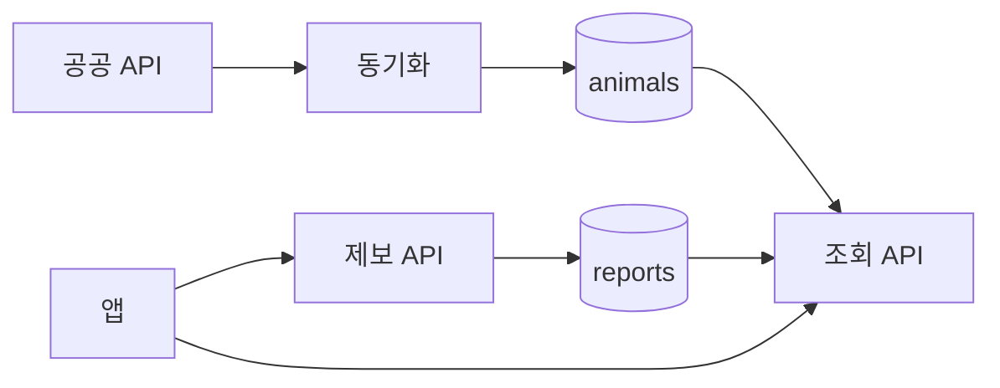

# 포포파인드(PawPawFind) 백엔드 기능 명세서

| 항목 | 내용 |
|------|------|
| 문서 버전 | 1.0 |
| 대상 | 백엔드 (Spring Boot) — 주 담당 **강유진** |
| 관련 문서 | [DB 스키마](./database.md) · [BE 할 일](./backend-할일.md) |
| 로컬 | `http://127.0.0.1:8080` (https 아님) · Swagger `http://127.0.0.1:8080/swagger-ui.html` |

---

## 0. 문서 안내

- **이 파일:** API·화면 흐름·팀 기능표 (무엇을 만드는지)
- **database.md:** 테이블·컬럼·제약 (어디에 저장하는지)
- **backend-할일.md:** 강유진이 앞으로 구현할 목록

회원(`users`)은 아직 없다. 제보의 `userId`는 비워 둘 수 있다.

---

## 1. 강유진(BE) 담당 — 팀 기능표 매핑

### 1.1 이름이 명시된 담당 (우선)

| 기능 ID | 주 기능 | BE가 할 일 | 우선순위 | 현재 |
|---------|---------|------------|----------|------|
| **2.1** | 실종 동물 등록 — 기본 정보 | 종류/크기/색상 저장 | 🔴 | CRUD 있음 |
| **2.4** | 실종 동물 등록 — 실종 정보 | 장소·날짜·시간 저장 | 🔴 | CRUD 있음 |
| **2.5** | 발견 동물 제보 — 발견 정보 | 발견 장소·날짜·시간 저장 | 🔴 | CRUD 있음 |
| **6.1** | 공공데이터 수집 | 구조동물 API 호출 | 🔴 | `GET /abandoned`에서 수집 |
| **6.2** | 동물 정보 저장 | ID/사진/품종/색상/위치 등 DB 저장 | 🔴 | H2 `animals` |
| **6.3** | 데이터 동기화 | 주기적 신규·변경 반영 | 🔴 | 스케줄 없음 (요청마다 수집) |

### 1.2 BE가 같이 필요한 기능

| 기능 ID | 내용 | 비고 |
|---------|------|------|
| 2.3, 2.7 | 특징(태그) 입력 저장 | `/api/report-features` 있음 |
| 2-1 | 실종 제보 목록 조회·필터·페이지네이션 | 목록만. 필터/페이지 없음 |
| 1.1~1.4 | 회원/마이페이지 | 🟡 나중 |
| 4.x | 매칭 결과·보호소/제보 상세 조회 API | AI 결과 저장·조회 |
| 5.x | 지도용 좌표·주변 검색 API | 🟢~🟡 |
| 6.5 | Embedding 저장 연동 | AI 주, BE는 저장 API/필드 |
| 7.x | 알림 | 🟢 나중 |

### 1.3 BE 범위 밖

| 기능 ID | 담당 | 내용 |
|---------|------|------|
| 2.2, 2.6 | FE + AI | 사진 업로드·품종 추론 UI/AI |
| 3.1~3.6 | AI (주가빈) | 유사도·종합 점수·Top-N |
| 6.4 | AI | 이미지 Embedding 생성 |
| 8.x / 9.x | AI (김가윤) | 예상 이동 경로 |
| 10.x / 11.x | FE + BE (추후) | 후기/커뮤니티 |

---

## 2. 팀 전체 기능표 (원본)

팀에서 공유한 기능 목록. 담당자가 비어 있으면 미정.

| 구분 | 기능 ID | 주 기능 | 세부 기능 | 상세 설명 | 담당 | 담당자 | 우선순위 |
|------|---------|---------|-----------|-----------|------|--------|----------|
| 1. 회원/계정 | 1.1 | 회원가입 | 소셜 회원가입 | 카카오/구글 회원가입 | FE + BE | | 🟡 |
| 1. 회원/계정 | 1.2 | 로그인 | 소셜 로그인 | 가입한 SNS 계정을 이용한 로그인 | FE + BE | | 🟡 |
| 1. 회원/계정 | 1.3 | 마이페이지 | 내 정보 관리 | 닉네임 정보 관리 (프로필 사진 없음) | FE + BE | | 🟡 |
| 1. 회원/계정 | 1.4 | 마이페이지 | 내 신고/제보 관리 | 등록한 실종·발견 동물 확인 및 관리 | FE + BE | | 🟡 |
| 2. 동물 등록 | 2.1 | 실종 동물 등록 | 기본 정보 입력 | 동물 종류(강아지, 고양이), 품종(선택), 성별(선택), 색상 등 입력 | FE + BE | 강유진 | 🔴 |
| 2. 동물 등록 | 2.2 | 실종 동물 등록 | 사진 등록 | 실종 동물 사진 업로드. AI가 품종 결과를 알려줌. 최소 1개, 최대 3개 | FE + AI | | 🔴 |
| 2. 동물 등록 | 2.3 | 실종 동물 등록 | 특징 입력 | 외형적 특징을 태그(카테고리) 형태로 입력 | FE + BE | | 🔴 |
| 2. 동물 등록 | 2.4 | 실종 동물 등록 | 실종 정보 입력 | 실종 장소, 날짜(YYYY.MM.DD), 시간(HH, 1시간 단위) | FE + BE | 강유진 | 🔴 |
| 2. 동물 등록 | 2.5 | 발견 동물 제보 | 발견 정보 입력 | 발견 장소, 날짜, 시간 등 입력 | FE + BE | 강유진 | 🔴 |
| 2. 동물 등록 | 2.6 | 발견 동물 제보 | 발견 사진 등록 | 발견 동물 사진 업로드 | FE + AI | | 🔴 |
| 2. 동물 등록 | 2.7 | 발견 동물 제보 | 특징 입력 | 색상, 품종, 외형적 특징 등 입력 | FE + BE | | 🔴 |
| 2-1. 실종 제보 조회 | 2-1 | 실종 제보된 동물 조회 | 실종 제보 동물 조회 | 페이지네이션 기반 조회, N개씩, 최신순 기본 | | | |
| 2-1. 실종 제보 조회 | 2-1 | 실종 제보된 동물 조회 | 실종 제보 동물 필터링 | 입력 폼 값 기반 필터링 | | | |
| 3. AI 동물 매칭 | 3.1 | 이미지 분석 | 이미지 유사도 분석 | 업로드 사진과 DB 동물 사진의 시각적 유사도 비교 | AI | 주가빈 | 🔴 |
| 3. AI 동물 매칭 | 3.2 | 특징 분석 | Tag 유사도 분석 | 품종, 색상, 특징 등 정보 비교 | AI | 주가빈 | 🔴 |
| 3. AI 동물 매칭 | 3.3 | 위치 분석 | 위치 유사도 분석 | 실종 위치와 발견 위치의 거리·위치 비교 | AI + BE | 주가빈 | 🔴 |
| 3. AI 동물 매칭 | 3.4 | 종합 분석 | 종합 매칭 점수 | 이미지 + Tag + 위치 정보를 종합해 매칭 점수 계산 | AI | 주가빈 | 🔴 |
| 3. AI 동물 매칭 | 3.5 | 후보 검색 | 후보 리스트 생성 | 매칭 점수가 높은 동물을 우선순위 순으로 제공 | AI + BE | 주가빈 | 🔴 |
| 3. AI 동물 매칭 | 3.6 | 후보 검색 | Top-N 후보 제공 | 여러 후보를 사용자가 비교 (50점 이상) | AI + FE | 주가빈 | 🔴 |
| 4. 매칭 결과 | 4.1 | 결과 조회 | 매칭 후보 확인 | AI가 추천한 유사 동물 목록 확인 (보호소 + 제보) | FE + BE | | 🔴 |
| 4. 매칭 결과 | 4.2 | 결과 조회 | 후보 상세정보 | 후보 상세 | FE + BE | | 🔴 |
| 4. 매칭 결과 | 4.3 | 결과 조회 | 매칭 점수 확인 | 후보별 AI 매칭 점수 및 우선순위 | FE + AI | | 🔴 |
| 4. 매칭 결과 | 4.4 | 결과 조회 | 보호소 정보 확인 | 사진, 공고번호, 동물종류, 색상, 성별, 발견 장소, 공고 기간, 보호 장소 | FE + BE | | 🔴 |
| 4. 매칭 결과 | 4.5 | 결과 조회 | 제보 정보 확인 | 제목, 사진, 동물종류, 색상, 성별, 발견 장소, 발견 시간, 태그 + 예상 경로 | FE + BE | | 🔴 |
| 5. 지도/위치 | 5.1 | 지도 | 실종 위치 표시 | 내가 등록한 동물의 실종 위치 | FE + BE | | 🟢 |
| 5. 지도/위치 | 5.2 | 지도 | 발견 위치 표시 | 제보된 동물의 발견 위치 | FE + BE | | 🟢 |
| 5. 지도/위치 | 5.3 | 지도 | 보호소 위치 표시 | 보호소 위치 및 정보 | FE + BE | | 🟢 |
| 5. 지도/위치 | 5.4 | 지도 | 주변 제보 검색 | 특정 위치 주변의 관련 제보 확인 | FE + BE | | 🟡 |
| 5. 지도/위치 | 5.5 | 지도 | 위치 기반 필터 | 지역 / 거리 / 날짜 기준 후보 필터링 | FE + BE | | 🟡 |
| 6. 보호소 데이터 | 6.1 | 공공데이터 연동 | 보호소 데이터 수집 | 공공 API를 통해 유기동물 데이터 수집 | BE | 강유진 | 🔴 |
| 6. 보호소 데이터 | 6.2 | 공공데이터 연동 | 동물 정보 저장 | 동물 ID, 사진, 품종, 색상, 위치 등 저장 | BE | 강유진 | 🔴 |
| 6. 보호소 데이터 | 6.3 | 공공데이터 연동 | 데이터 동기화 | 새로운 보호동물 및 변경 정보를 주기적으로 업데이트 | BE + AI | 강유진 | 🔴 |
| 6. 보호소 데이터 | 6.4 | AI 데이터 구축 | 이미지 Embedding 생성 | 보호소 동물 사진을 AI 검색용 벡터로 변환 | AI | | 🔴 |
| 6. 보호소 데이터 | 6.5 | AI 데이터 구축 | Embedding 저장 | 생성된 벡터를 검색 가능한 형태로 저장 | AI + BE | | 🔴 |
| 7. 알림 | 8.1 | 알림 | 새로운 후보 알림 | 기존 검색과 관련된 새 동물이 등록되면 알림 | FE + BE | | 🟢 |
| 7. 알림 | 8.2 | 알림 | 주변 제보 알림 | 설정한 지역 주변에 새 제보가 등록되면 알림 | FE + BE | | 🟢 |
| 8. 수색 지원 | 9.1 | 예상 이동 경로 | 이동 가능 지역 예측 | 실종 위치·시간 기반 예상 이동 지역 제공 | AI | 김가윤 | 🟡 |
| 8. 수색 지원 | 9.2 | 예상 이동 경로 | 수색 우선 지역 표시 | 예상 이동 지역을 지도에 표시 | AI + FE | 김가윤 | 🟡 |
| 10. 후기/커뮤니티 | 11.1 | 후기 | 후기 작성 | 서비스 이용 후기 작성 | FE + BE | | 🟢 |
| 10. 후기/커뮤니티 | 11.2 | 후기 | 성공 사례 공유 | 매칭 성공 및 찾은 사례 공유 | FE + BE | | 🟢 |
| 10. 후기/커뮤니티 | 11.3 | 커뮤니티 | 댓글 작성 | 댓글, 대댓글 작성 | | | |

> 알림·수색·후기는 팀 표에서 구분 번호와 기능 ID가 다름 (구분 7→ID 8.x, 구분 8→ID 9.x, 구분 10→ID 11.x).

---

## 3. 시스템 개요

데이터 소스는 두 종류다. 서로 FK로 묶지 않는다.

1. **공공 공고** — 보호소/지자체 공고 (`animals`)
2. **사용자 제보** — 실종/목격 직접 등록 (`reports` + 사진 + 특징)

사용자는 백엔드 API만 호출한다. 공공 API는 **동기화 작업**만 호출하는 것이 목표다. (현재는 `GET /abandoned`가 매번 공공 API를 친다.)

```text
[공공 API] --(스케줄 sync, 목표)--> [DB: animals]
[사용자 앱] --(제보 등록)----------> [DB: reports]
[사용자 앱] <--(목록/상세)--------- [Spring API]
[AI] <--------(매칭용 데이터)------ [Spring API]
```



---

## 4. 현재 API

JSON 필드명은 **camelCase** (`eventDate`, `reportType`).  
`breed`, `sex`, `featureTags`는 제보 본문에 없다. 특징은 `report_features`로 따로 보낸다.

### 4.1 공공 공고

| 메서드 | 경로 | 설명 |
|--------|------|------|
| GET | `/abandoned` | 공고중(`state=notice`) 전건을 공공 API에서 받아 `animals`에 저장한 뒤 목록 반환. 무겁다. |

목표 경로 (아직 없음): `GET /api/animals`, `GET /api/animals/{desertionNo}` — **DB만 읽기**.

### 4.2 제보 (`reports`)

| 메서드 | 경로 | 설명 |
|--------|------|------|
| POST | `/api/reports` | 등록. `status` 없으면 `OPEN`. |
| GET | `/api/reports` | 전체 목록. 필터·페이지 없음. |
| GET | `/api/reports/{reportId}` | 단건. 없으면 body가 null. |
| PUT | `/api/reports/{reportId}` | 수정. id·userId·createdAt은 유지. |
| DELETE | `/api/reports/{reportId}` | 삭제. 사진/특징 cascade 없음. |

**등록 필드**

| 필드 | 필수 | 설명 |
|------|------|------|
| `reportType` | Y | `LOST` / `FOUND` |
| `title` | N | FOUND만 |
| `species` | Y | 강아지 / 고양이 |
| `size` | Y | 소형 등 |
| `color` | Y | 색상 |
| `eventDate` | Y | `YYYY-MM-DD` |
| `eventHour` | N | 0~23 |
| `happenPlace` | Y | 장소 텍스트 |
| `latitude` / `longitude` | Y | 지도 좌표 |
| `description` | Y | 설명 |
| `userId` | N | 회원 연동 전 null |
| `status` | N | 기본 `OPEN` |

### 4.3 제보 사진 (`report_photos`)

파일 업로드는 없다. **URL만** 저장한다. 제보를 먼저 만든 뒤 `reportId`를 넣는다.

| 메서드 | 경로 | 설명 |
|--------|------|------|
| POST | `/api/report-photos` | 등록 |
| GET | `/api/report-photos` | 목록. **지금은 전체 사진** (reportId 필터 미구현) |
| GET | `/api/report-photos/{id}` | 단건 |
| PUT | `/api/report-photos/{id}` | URL·순서 수정 |
| DELETE | `/api/report-photos/{id}` | 삭제 |

요청: `reportId`, `photoUrl`, `sortOrder`(선택)

### 4.4 제보 특징 (`report_features`)

| 메서드 | 경로 | 설명 |
|--------|------|------|
| POST | `/api/report-features` | 등록 |
| GET | `/api/report-features?reportId=` | 해당 제보 태그만 |
| GET | `/api/report-features/{id}` | 단건 |
| PUT | `/api/report-features/{id}` | category·keyword 수정 |
| DELETE | `/api/report-features/{id}` | 삭제 |

요청: `reportId`, `category`, `keyword`

---

## 5. 화면별 필요 데이터

### 홈/목록 (공공 공고)

`desertionNo`, `popfile1`, `kindNm`, `colorCd`, `sexCd`, `happenPlace`, `happenDt`, `processState`, `orgNm`

### 상세/매칭 결과 (공공 공고)

위 + `popfile2`, `careNm` / `careTel` / `careAddr`, `specialMark`, `weight`, `neuterYn`, `noticeNo` / `noticeSdt` / `noticeEdt`  
입양·봉사 문구는 저장하지 않는다.

### 제보 등록

유형(LOST/FOUND), 사진 URL 1~3, 종류, 크기, 색상, 특징 태그, 날짜·시간, 장소·좌표, 설명.  
품종·성별은 팀 표에는 있으나 **현재 제보 테이블에 컬럼 없음**.

### 제보 맵/타임라인

사진, 유형, 위치, 일시, 짧은 설명

---

## 6. 비기능

| 항목 | 목표 |
|------|------|
| 공공 API | 사용자 요청 경로에서는 호출하지 않음 (동기화만). **아직 미달** |
| 응답 | JSON, camelCase |
| 에러 | 404/500을 명확히. **지금은 없으면 null** |
| 키 | `animal.api.key`를 GitHub에 올리지 않음 |
| 로컬 | `http://127.0.0.1:8080` |
| DB | 지금은 H2 메모리. 서버 재시작 시 데이터 삭제 |

---

## 7. 팀 인터페이스

| 상대 | 백엔드가 제공할 것 |
|------|-------------------|
| AI | 공고 + 제보의 사진 URL, ID, 품종/색상, `updatedAt`, 변경분 API |
| 프론트 | 공고 목록/상세, 제보 등록 필드, 제보 목록/맵용 좌표 |
| 인프라 | 초기 EC2 단일, 이후 RDS/스케줄/S3 분리 가능 |
